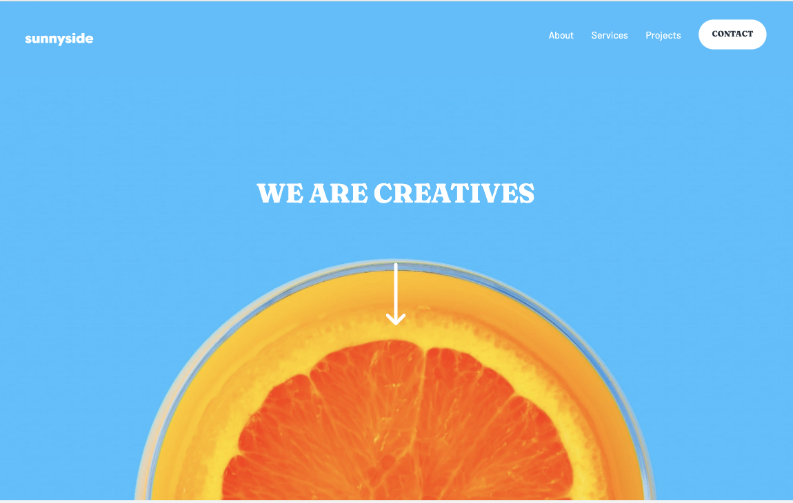
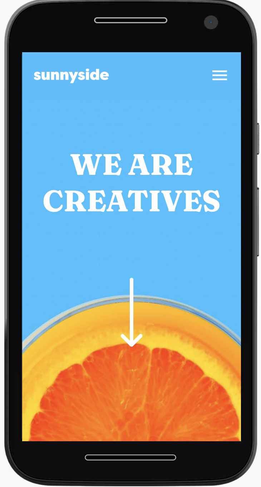

# ✨Sunnyside agency landing page

This is a solution to the [Sunnyside agency landing page challenge on Frontend Mentor](https://www.frontendmentor.io/challenges/sunnyside-agency-landing-page-7yVs3B6ef). It was built with React js, using SASS, HTML, JavaScript, Bootstrap and Material UI.

## Table of contents

  - [The challenge](#the-challenge)
  - [Screenshot](#screenshot)
  - [Links](#links)
- [My process](#my-process)
  - [Built with](#built-with)
- [Author](#author)
- [Acknowledgments](#acknowledgments)

### 💡The challenge

Users should be able to:

- View the optimal layout for the site depending on their device's screen size
- See hover states for all interactive elements on the page

### 📷Screenshot

- Desktop: 

- Mobile: 

### 📌Links

- Live Site URL: [Live site url](https://mariapenaa.github.io/sunnyside-landing/)

## 📈My process
I coded this website mobile-first, using flexbox for the layout. I also added some simple on-scroll-animations along with hover effects.

### 🔨Built with

- Semantic HTML5 markup
- SASS
- Flexbox
- Mobile-first workflow
- [React](https://reactjs.org/) - JS library
- Material UI
- Bootstrap
- Material UI icons

### 💁🏽‍♀️Author

<!-- - Website - [Maria Peña](https://www.your-site.com) -->
- Frontend Mentor - [@mariapenaa](https://www.frontendmentor.io/profile/mariapenaa)

